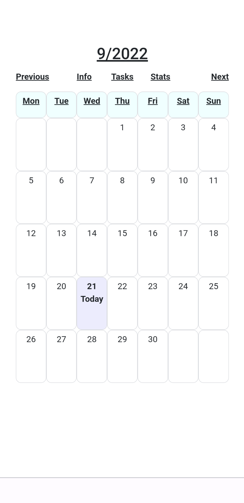
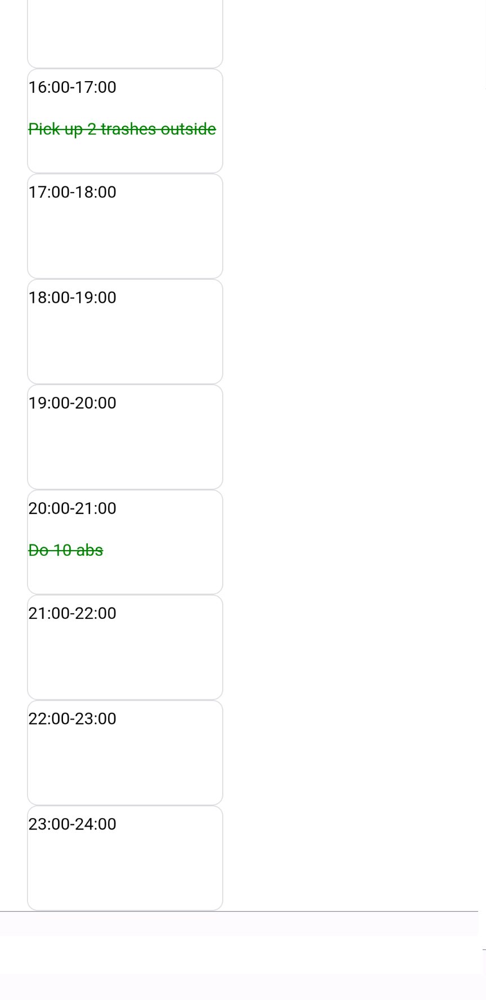
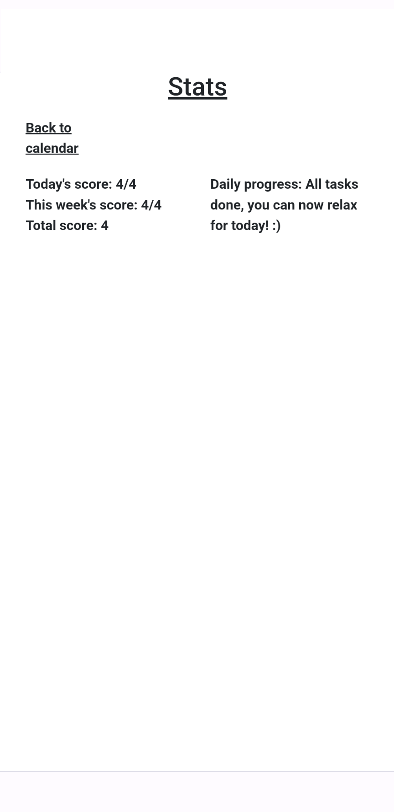

# Project 1: Tasklendar
Can be found and used at https://lucky-otter-2cfd75.netlify.app/.

## Purpose of the project
To gamify different kinds of tasks which you would like to achieve during a day. Tasks can be related to anything from sports to cleaning.

## How to use application
App will generate tasks randomly for you in the today's view between hours of 10-21 based of different task lists. You then need to do them if possible and if you have succeeded, you can swipe right to complete a task which will be recorded as a point. When swiping left, the task is undone. Swiping only works on touch screen. If you do not have touch screen, you can click the task to complete it and if you click the task again, it will be undone.

In the task menu you can see a list of some random tasks depending on difficulty. You can add more of those tasks if needed and you may delete the ones that you do not need. You can also add a special task for a certain date and time if needed.

In the stats menu you can track your progress.

## Disclaimer
Added tasks, stats and history are saved on your browser's local storage, so if you clear the history in your browser, all the created data in local storage will be cleared also.

## Status of the project
Ready to use.

## Pictures

